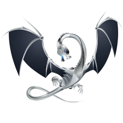

## Hey! here

### 🙋‍♂️ I'm **WadeGao**, a software engineer from China.

-   🌏 I come from China
-   🐧 Now I'm working for Tencent
-   🛠 I’m currently using C++ and Python3
-   💬 Ask me about anything related to program
-   🌱 I’m currently learning compiler and architecture
-   🔭 Doing something about open source
-   🌊 I like to walk by the sea and blow the sea breeze
-   📫 contact me at gao_ziyu@foxmail.com
-   💬 WeChat Official Accounts：WadeLearnsToCode

## 🚀 Language And Tools

	
	
	
	
	
	
	
	
	
	
	

## 👨‍💻 My Contribution Details
<!-- minimal -->

	</img>

